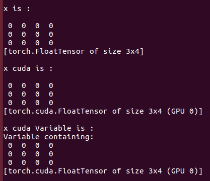
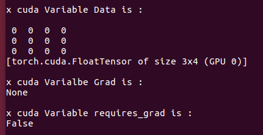
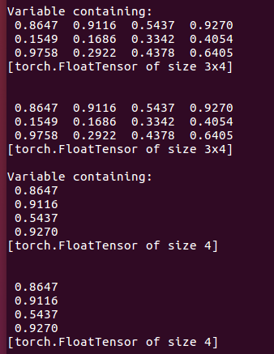
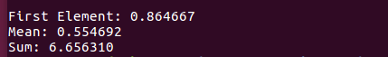

# 1. Variable and AutoGrad

## 1.1 Tensor and Variable

[Back to Home](https://github.com/taeoh-kim/Pytorch_Tutorial)

---

Default Mode is GPU Mode. If not, remove all GPU functions (ex. .cuda() or .cpu())

### 1. GPU Check

If your CUDA is available, code will print below result.

### 2. Basic Tensor and Variable

When you define tensor and CUDA-tensor, it will give below results.

In above, Variable makes your tensor as variable.

So what is a Variable? It contains

- Data: Your tensor or CUDA-tensor
- Grad: Gradient of your tensor node

### 3. Varaible's Components

Below results show components of Variable.

Data, Grad and Requires_grad

Requires_grad will be True when you use Neural Network Module.

### 4. Data Access

Here are some examples which you can access to Varaible and its data.

And how to obtain scalar, mean and sum of Variable.

