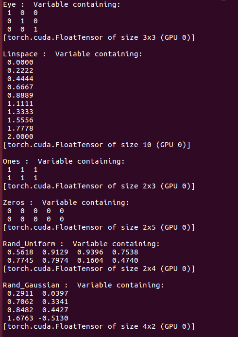
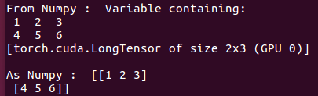

# 1. Variable and AutoGrad

## 1.2 Tensor Initialization

[Back to Home](https://github.com/taeoh-kim/Pytorch_Tutorial)

---

### 1. Various Tensor Initialization

Below examples show the Numpy-style Tensor Initializations.

### 2. Numpy Usage

You can make Tensor from Numpy and vice versa.

