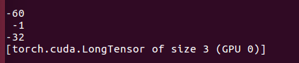
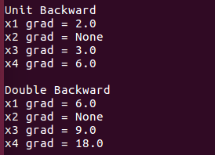
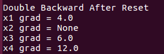

# 1. Variable and AutoGrad

## 1.3 Autograd Calculation

[Back to Home](https://github.com/taeoh-kim/Pytorch_Tutorial)

---

### 1. Computational Graph

You will build simple computational graph.

- y = 2 x (x1) + 3 x (x2) + 1
- x2 = (x3) + 2 x (x4)

Computation result is

### 2. Automatic Gradient Calcuation

How about you give a unit Back-propagation.

From the chain rule, you can easily calculate each node's gradient.

How about you back-propagate 2.0?

Just double? Below is the result

However, the result is triple.

### 3. Gradient Reset

It is because previous gradient still remains.

So we need to reset gradients.

After reset, it will give true result.

