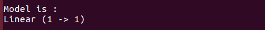
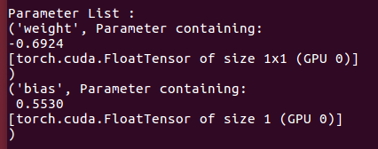
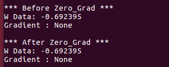
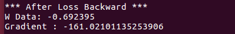
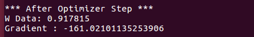
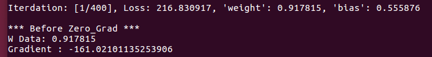
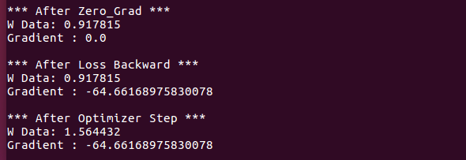
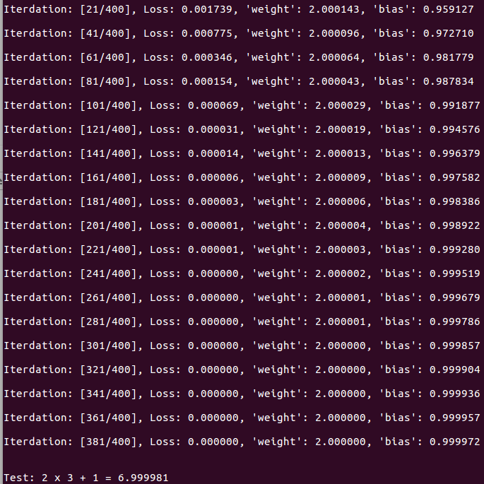

# 1. Variable and AutoGrad

## 1.4 Autograd Calculation in Linear Regression

[Back to Home](https://github.com/taeoh-kim/Pytorch_Tutorial)

---

### 1. Overview

This code contains overall process of Machine Learning

- Define Data / Model / Optimizer
- Training Lopp / Define Loss / Optimization
- Print Log and Test

### 2. Define Input Data

Input data is 1-D.

X = Random Values

Y = 2x+1 (Linear Function)

The objective of this code is to estimate Linear Function from given data.

### 3. Define Model

There is only one parameter (includes bias 1) which is (w = 2).

So we can define 1-Layer network using Pytorch's NN Module.

After set the model as CUDA, you can print model.

### 4. Printing Parameters

And also, you can print parameters using "named_parameters()"

Pytorch automatically assign network parameters' name and Initial Value.

### 5. The First Training Loop

After define Optimizer (SGD), the training loop begins.

In the first loop, you can print W and its gradient.

And you can print them after Gradient Reset of Network.

But, there is no gradient in W.

### 6. Forward and Backward Process

Because, there is no forward and backward process in network.

So, you run forward pass using the data.

And define loss function (Mean Squared Error).

Then, back-propagates using this loss value.

After then, you can print W and its gradient.

### 7. Optimizer Step

Your parameter (W) should be updated by this Gradient!

optimizer.step() performs this.

After this step,

### 8. So, What is the zero_grad()?

In the second training iteration and before zero_grad(),

In above result, previous gradient still remains.

So we have to reset this for next step.

After zero_grad, back-propagation and optimizer step,

### 9. How about the Linear Regression Result?

Below result shows the linear regression result up to 400 Iteration.

As you can see, loss goes to zero and parameters go to our intuition.

And the last line of result, you can test this model using numerial example.
